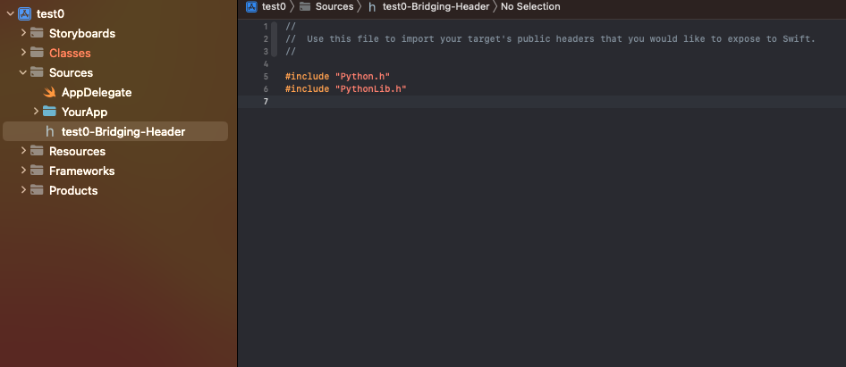
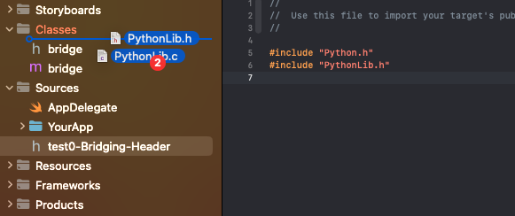

# 1. Setup a kivy-ios environment and create a project 

[https://github.com/kivy/kivy-ios#kivy-for-ios](url)


# 2. Modify Xcode Project

download the following files:

[AppDelegate.swift](https://raw.githubusercontent.com/PythonSwiftLink/PythonSwiftLinkSupportFiles/main/project_support_files/AppDelegate.swift)


add **AppDelegate.swift** to the same group(Sources) as the deleted main.m


when adding a swift file to a objc the first time, you will be prompted with the following question:


press Create Bridging Header.

select the Bridging Header file and insert these 2 lines.

```objc
#include "Python.h"
#include "PythonLib.h"
```


now clone the 2 following repos to your kivy-ios folder.

```
git clone --branch main https://github.com/PythonSwiftLink/PythonLib
git clone --branch testing https://github.com/PythonSwiftLink/PythonSwiftCore
```


add the 2 following files from PythonLib to example the classes group

`<your kivy-ios folder>/PythonLib/Sources/PythonLib/include/PythonLib.h`

`<your kivy-ios folder>/PythonLib/Sources/PythonLib/PythonLib.c`




now add PythonSwiftCore folder to the Sources Group
`<your kivy-ios folder>/PythonSwiftCore/Sources/PythonSwiftCore`


hopefully your project tree should now look like something like this


Now only 1 error should be remaining (Fixing PythonSwiftImportList Error)


AppDelegate is looking for an Array named PythonSwiftImportList, but doesnt exist yet.

so create a new .swift file, and just name it PythonSwiftImportList.swift


insert the following content

```swift
// PythonSwiftImportList.swift
import Foundation

let PythonSwiftImportList: [PySwiftModuleImport] = [
	//insert PySwiftModule import functions here
]
```

